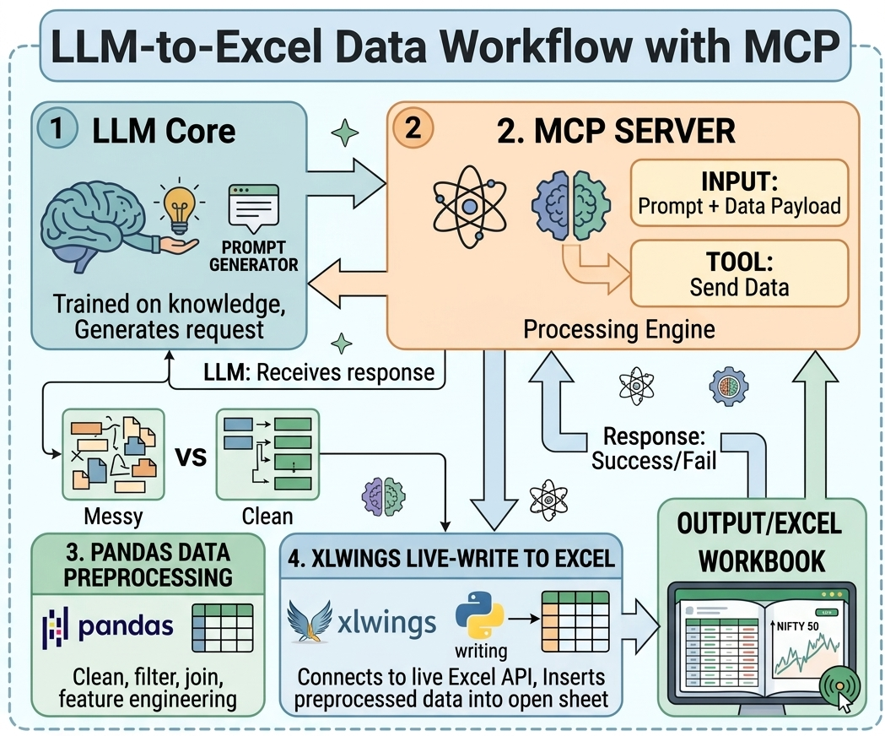

# 🎸 FluxSheet - MCP Server for Excel Interaction

## 📌 Overview
This project is an **MCP (Model Context Protocol) server** that enables **Large Language Models (NLMs)** to interact directly with **local Excel files**.

It leverages the open-source library **xlwings** to perform **real-time data operations on Excel files**, even when they are actively open. This allows seamless automation, manipulation, and querying of spreadsheet data using natural language.

This MCP server is optimized for standard tabular structures, strictly adhering to the conventional **vertical column and horizontal row orientation**.

---

## 🚀 Features
- 🧠 **NLM Integration**  
  Interact with Excel files using natural language commands.

- 📊 **Live Excel Editing**  
  Read/write data even when the Excel file is open.

- ✍️ **Real-Time Data Writing**  
  Uses *xlwings* to update spreadsheets without locking issues.

- 🔄 **Data Manipulation**  
  Perform operations like:
  - Insert / update rows
  - Modify cell values

- ⚡ **MCP Server Architecture**  
  Acts as a bridge between language models and local file systems.

---

## 🏗️ Architecture

---

## Tools
| Name | Purpose |
| ------ | ------ |
| write_data_live | Write or append data to the table|
| update_data_live | Update data in the table |
| add_line_chart | Add a matplotlib line chart |
| add_pie_chart | Add a matplotlib pie chart |
---

## 📦 Core libraries
- [Python MCP SDK](https://github.com/modelcontextprotocol/python-sdk)
- [xlwings](https://github.com/xlwings/xlwings)

---

## ⚙️ Installation

```python
# installation
git clone https://github.com/khanabdullah9/Excel-MCP.git
uv init
uv add -r requirements.txt


